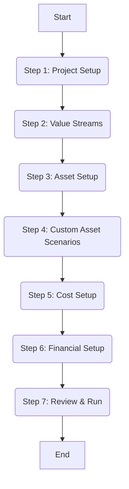

# Simulation System Documentation

## 1. Overview

This document provides a detailed description of the simulation system implemented within the Axia frontend application. The system allows users to configure, run, and analyze complex energy project simulations based on various asset types (PV, BESS, HV, Load, Interconnection), value streams, costs, and financial parameters.

**Purpose & Scope:**
The primary goal is to enable users to model different project configurations and financial scenarios to determine optimal designs and understand project economics (e.g., LCOE, NPV). The system supports creating multiple simulations within a project, each containing potentially thousands of individual scenarios based on parameter variations.

**Key Features:**

- Multi-step simulation setup wizard.
- Configuration of project details (name, life, discount rate, start date, ITC).
- Selection of value streams (e.g., load fulfillment).
- Detailed asset setup (PV, BESS, Load, Interconnection, HV) with parameter configuration, including ranges for scenario generation.
- Support for uploading custom parameter files (CSVs) for assets.
- Definition of custom asset scenarios for specific parameter combinations.
- Cost setup (CAPEX, OPEX) for each asset.
- Financial setup (ITC).
- Review step displaying the generated JSON configuration.
- Validation of the simulation configuration against backend rules.
- Running simulations via API calls.
- Viewing simulation results, comparing scenarios, and visualizing data (in `SimulationDashboard`).
- Editing existing simulations.
- Loading existing simulation configurations from JSON files.
- Saving and restoring simulation progress using `localStorage`.

**Technologies:**

- React (v18)
- TypeScript
- Ant Design (antd v5) for UI components (Form, Modal, Table, Select, Button, etc.)
- Lucide Icons
- Axios for API communication
- Day.js for date handling
- Styled Components (minor usage)
- Tailwind CSS (primary styling framework)

## 2. Architecture

_(Refer to the Napkin.ai diagram generated based on the provided prompt for a visual representation)_

The simulation system follows a component-based architecture primarily centered around the `Simulation.tsx` component for setup and the `SimulationDashboard.tsx` for viewing results.

**UI Layer:**

- `Simulation.tsx`: Acts as the main wizard container, managing the multi-step form state and orchestrating the setup process. It renders step-specific components.
- Step Components (`ProjectSetupStepComponent`, `ValueStreamsStepComponent`, `AssetSetupStepComponent`, etc.): Each handles the UI and logic for a specific configuration step.
- `SimulationDashboard.tsx`: Displays simulation status, results (tables, charts via Plotly), allows scenario comparison, and provides actions like editing or deleting simulations/scenarios.
- `FileUploadModal.tsx`: Used for uploading parameter files or existing simulation JSON.
- `CostRoadmapTable.tsx` & `PhysicalModels.tsx` components: Provide input data (cost roadmaps, physical models) that can influence simulation parameters, although direct integration isn't fully shown in the provided `Simulation.tsx` code.

**Data Flow:**

1.  **Initiation:** User navigates to create a new simulation or edit an existing one within a project context (`projectId`, `projectName`).
2.  **Setup:** The `Simulation.tsx` component guides the user through the steps. State (`formData`) is managed within `Simulation.tsx` and updated by child step components via `onChange` callbacks.
3.  **Configuration Generation:** As the user progresses, especially in the Asset Setup and Custom Scenarios steps, the system calculates potential scenario combinations (`totalCombinations` state).
4.  **Validation:** Before running, the configuration (formatted as JSON via `generatePreview`) is sent to the backend for validation (`API_ENDPOINTS.SIMULATIONS.VALIDATE`).
5.  **Saving & Running:** If valid, the full configuration JSON is sent to the backend to create/update the simulation (`API_ENDPOINTS.SIMULATIONS.CREATE`). Immediately after, a request is sent to run the simulation (`API_ENDPOINTS.SIMULATIONS.RUN`).
6.  **Progress & Results:** The system likely polls for status (`API_ENDPOINTS.SIMULATIONS.STATUS`) or receives updates. Results are fetched (`API_ENDPOINTS.SIMULATIONS.RESULTS`, potentially CSVs via S3) and displayed in `SimulationDashboard.tsx`.
7.  **Local Persistence:** User progress within the simulation setup wizard is saved to `localStorage` (`SIMULATION_PROGRESS_KEY_<projectId>`) and can be restored if the user leaves and returns.

**Backend Integration:**

- The frontend communicates with a RESTful backend API (defined in `ApiEndpoints.ts`).
- Authentication is handled via JWT tokens (`Authorization: Bearer ${token}`).
- Key interactions involve fetching project/simulation details, validating configurations, creating/updating simulations, running simulations, and fetching results/scenarios.
- Parameter files (.csv) are likely uploaded to S3 via presigned URLs generated by the backend (`API_ENDPOINTS.PARAMS_FILES.S3_URL_UPLOAD`).

## 3. Simulation Workflow

The simulation setup process follows a defined multi-step workflow managed by the `Simulation.tsx` component:

**Workflow Description:**

1.  **Project Setup:**
    - **Component:** `ProjectSetupStepComponent` (rendered within `Simulation.tsx`)
    - **Purpose:** Configure basic simulation metadata.
    - **Values Populated:** Simulation Name, Useful Life (years), Discount Rate (%), Starting Date, Investment Tax Credit (ITC %).
    - **Logic:** Uses Ant Design `Form` (`form` instance managed by `Simulation.tsx`). Input values update the `formData.projectSetup` state via `handleInputChange`. A default name is generated if creating a new simulation. Allows loading an existing simulation JSON via file upload (`handleLoadExistingSimulation`). Options to load/remove default configurations.
2.  **Value Streams:**
    - **Component:** `ValueStreamsStepComponent` (rendered within `Simulation.tsx`)
    - **Purpose:** Select the economic value streams the simulation should consider (e.g., load fulfillment, grid services).
    - **Values Populated:** An array of strings representing selected value streams (`formData.valueStreams`).
    - **Logic:** Likely a checkbox group or multi-select component updating state via `handleInputChange`. Default is `["load_fullfilment"]`.
3.  **Asset Setup:**
    - **Component:** `AssetSetupStepComponent` (rendered within `Simulation.tsx`)
    - **Purpose:** Define the assets (PV, BESS, Load, IC, HV) included in the simulation and configure their parameters. This is crucial for scenario generation.
    - **Values Populated:** An array of `Asset` objects (`formData.assets`). Each asset has a `name`, `type`, and a `parameters` object (e.g., `nameplate_capacity`, `duration`, `params_file`, `capex`, `opex`).
    - **Parameter Input:** Parameters can be configured in several ways:
      - **Single Value:** Standard input for a fixed parameter value (e.g., `nameplate_capacity: 100`).
      - **Range:** Input using the format `start:step:end` (e.g., `duration: 2:1:4`) to generate scenarios for 2, 3, and 4 hours.
      - **List:** Input using comma-separated values (e.g., `round_trip_efficiency: 0.9, 0.95`) to generate scenarios for each value.
      - **Parameter File:** A special `params_file` parameter allows associating a CSV file containing time-series data or other detailed parameters. Users can select existing uploaded files (fetched via `API_ENDPOINTS.PARAMS_FILES.GET_FILENAMES`), upload new ones (using `handleFileUpload` which gets a presigned URL via `API_ENDPOINTS.PARAMS_FILES.UPLOAD_FILES` or `S3_URL_UPLOAD` and then uploads), download templates (`API_ENDPOINTS.PARAMS_FILES.GET_TEMPLATE`), or edit existing CSVs via a modal (`handleEditCsvFile` fetches content via `API_ENDPOINTS.PARAMS_FILES.GET` and saves via `API_ENDPOINTS.PARAMS_FILES.SAVE`).
    - **Logic:**
      - Users can add assets using the "Add Asset" button (calls `createNewAsset`), selecting the type (Generator, Storage, Load, Interconnection). Default parameters (including a default `params_file` name like `generator_params.csv`) are added automatically.
      - Assets can be removed.
      - Input fields for each parameter update the corresponding asset's parameters within `formData.assets` via `updateAsset`. Input validation (`validateField`) is performed based on rules defined in `assetValidations`.
      - The `calculateCombinations` utility is used to continuously update the total number of potential scenarios (`totalCombinations` state) based on the parameter ranges/lists defined.
      - The component manages file uploads for the `params_file` parameter, handling potential duplicates and updating the associated `files` array in the parameter object.
4.  **Custom Asset Scenarios:**
    - **Component:** `CustomAssetScenariosStep` (rendered within `Simulation.tsx`)
    - **Purpose:** Define specific combinations of asset parameters as distinct scenarios, overriding the automatic generation from ranges in the previous step.
    - **Values Populated:** An array of `Scenario` objects (`formData.customAssetScenarios`).
    - **Logic:** Provides a UI (likely a table or form) to manually define scenarios with specific parameter values for the configured assets. Updates state via `handleInputChange`. Recalculates `totalCombinations`.
5.  **Cost Setup:**
    - **Component:** `CostSetupStepComponent` (rendered within `Simulation.tsx`)
    - **Purpose:** Define Capital Expenditures (CAPEX) and Operational Expenditures (OPEX) for each asset.
    - **Values Populated:** Updates `capex` and `opex` parameters within each asset object in `formData.assets`.
    - **Logic:** Displays input fields for costs related to the assets defined in Step 3. Updates state via `handleInputChange`. May interact with `CostRoadmaps.tsx` data in a more complete implementation.
6.  **Financial Setup:**
    - **Component:** `FinancialSetupStepComponent` (rendered within `Simulation.tsx`)
    - **Purpose:** Configure project-wide financial parameters beyond the initial setup.
    - **Values Populated:** Currently updates `itc` and `discountRate` within `formData.projectSetup`.
    - **Logic:** Provides inputs for financial parameters, updating state via `handleInputChange`.
7.  **Review & Run:**
    - **Component:** `ReviewStepComponent` (rendered within `Simulation.tsx`)
    - **Purpose:** Display a summary of the configured simulation (likely the generated JSON preview) and allow the user to validate and run it.
    - **Values Populated:** Displays data derived from the final `formData`.
    - **Logic:** Calls `generatePreview` from `utils.ts` to create the JSON payload. Provides "Validate" (`handleValidate`) and "Run Simulation" (`handleRunSimulation`) buttons.
      - **Validation:** Sends the preview JSON to `API_ENDPOINTS.SIMULATIONS.VALIDATE`. Displays success or error messages/modals. Updates `validConfig` state.
      - **Run:** If validation passes (or is skipped), sends the preview JSON to `API_ENDPOINTS.SIMULATIONS.CREATE` to save the configuration, then immediately calls `API_ENDPOINTS.SIMULATIONS.RUN` with the returned `simulation_id`. Handles potential errors during creation or run. Clears `localStorage` on successful run initiation. Navigates away or triggers UI updates (e.g., progress modal, project refresh).

## 4. Key Components & Functionality

- **`Simulation.tsx`**:
  - **Purpose:** Orchestrates the entire simulation setup process. Manages the multi-step wizard UI, holds the primary `formData` state, handles navigation between steps, saves/loads progress, interacts with step components, and triggers validation/run API calls.
  - **State Management:** Uses `useState` for `activeStep`, `formData`, `totalCombinations`, loading/error states, etc.
  - **Local Storage:** Implements `saveStateToLocalStorage`, `loadStateFromLocalStorage`, and `clearSavedState` to persist user progress within a specific project (`getStorageKey`). Progress is automatically loaded on mount if recent and valid, and cleared upon successful simulation run.
  - **Editing vs Creating:** Handles both creating new simulations and editing existing ones (passed via `location.state.editingSimulation`). Generates default asset configurations and names for new simulations. Parses existing simulation data when editing.
  - **Scenario Calculation:** Uses `calculateCombinations` utility and updates `totalCombinations` based on asset parameter ranges and custom scenarios.
- **`SimulationDashboard.tsx`**:
  - **Purpose:** Displays the results and status of a specific simulation run. Allows users to compare scenarios, view data in tables and charts, manage chart configurations, and interact with simulation/scenario data (e.g., download results, delete scenarios).
  - **Data Fetching:** Fetches project details, simulation details (including status), and scenario results using various API endpoints (`PROJECTS.DETAIL`, `PROJECTS.SIMULATION_DETAIL`, `SIMULATIONS.SCENARIOS`, `SIMULATIONS.RESULTS`).
  - **Visualization:** Uses `PlotlyWrapper` (likely integrating `react-plotly.js`) to render scatter plots comparing scenarios based on user-selected X/Y axes and color groupings.
  - **Scenario Table:** Uses Ant Design `Table` to display scenario results. Includes features like column visibility selection (`Dropdown` + `Checkbox`), sorting, and pagination. Allows selecting multiple scenarios via checkboxes.
  - **Actions:** Provides buttons for downloading results (`handleDownloadResults` calling `SIMULATIONS.DOWNLOAD_RESULTS`), deleting selected scenarios (`handleDeleteSelectedScenarios` calling `SCENARIOS.DELETE`), editing the simulation (`handleEditSimulation`), and potentially adding new charts/tabs.
- **Step Components (`./simulation/*.tsx`)**:
  - **Purpose:** Encapsulate the UI and logic for each specific step in the simulation setup wizard.
  - **Interaction:** Receive necessary parts of `formData` and potentially the Ant Design `form` instance as props. Use an `onChange` prop (callback function like `handleInputChange` in `Simulation.tsx`) to pass updated data back to the parent `Simulation.tsx` component.
- **Utility Functions (`./simulation/utils.ts`)**:
  - **`generatePreview(formData, editingSimulation)`:** Takes the `formData` state and converts it into the structured JSON payload expected by the backend API for validation and creation/running. Handles differences between creating and editing.
  - **`calculateCombinations(asset)`:** Calculates the number of scenarios generated by a single asset based on its parameter ranges.
- **Type Definitions (`./simulation/types.ts`)**:
  - Defines crucial interfaces like `SimulationFormData`, `Asset`, `Scenario`, `ProjectSetupData`, etc., ensuring type safety throughout the simulation components.

## 5. API Usage

The simulation system relies heavily on the backend API defined in `src/constants/ApiEndpoints.ts`. Key endpoints used:

- **Fetching Data:**
  - `API_ENDPOINTS.PROJECTS.DETAIL`: Get project details (e.g., name).
  - `API_ENDPOINTS.PROJECTS.SIMULATION_DETAIL`: Get details of a specific simulation (name, status, description).
  - `API_ENDPOINTS.SIMULATIONS.SCENARIOS`: Fetch scenarios associated with a simulation run.
  - `API_ENDPOINTS.SIMULATIONS.RESULTS`: Fetch simulation results data (likely summary statistics per scenario).
  - `API_ENDPOINTS.SIMULATIONS.INPUT_JSON`: Get the original input configuration JSON for a simulation (used for editing).
  - `API_ENDPOINTS.AUX.GET_S3_FILELIST`: Fetch lists of available files (e.g., cost roadmaps, physical models) from S3.
  - `API_ENDPOINTS.AUX.DOWNLOAD_FILE_FROM_S3`: Download a specific file directly from S3 via the backend.
  - `API_ENDPOINTS.PARAMS_FILES.GET_FILENAMES`: Get parameter filenames for a specific asset type.
  - `API_ENDPOINTS.PARAMS_FILES.GET_TEMPLATE`: Download template parameter files.
- **Modifying Data / Running Simulations:**
  - `API_ENDPOINTS.SIMULATIONS.VALIDATE`: Validate a generated simulation configuration JSON. (Method: POST)
  - `API_ENDPOINTS.SIMULATIONS.CREATE`: Create a new simulation or update an existing one by posting the configuration JSON. (Method: POST)
  - `API_ENDPOINTS.SIMULATIONS.RUN`: Trigger a simulation run for a given simulation ID. (Method: POST)
  - `API_ENDPOINTS.SCENARIOS.DELETE`: Delete a specific scenario. (Method: DELETE)
  - `API_ENDPOINTS.SIMULATIONS.DOWNLOAD_RESULTS`: Download results (likely CSV/ZIP) for selected scenarios. (Method: POST)
  - `API_ENDPOINTS.SIMULATIONS.UPDATE_DESCRIPTION`: Update the description of a simulation. (Method: PATCH)
- **File Uploads:**
  - `API_ENDPOINTS.AUX.S3_URL_UPLOAD` or `API_ENDPOINTS.PARAMS_FILES.S3_URL_UPLOAD`: Get a presigned URL from the backend to upload files (like parameter CSVs) directly to S3. (Method: POST)
  - Direct `axios.put` request to the presigned S3 URL.

## 6. Data Flow and Logic

- **State Management:** The primary state (`formData`) is held within the `Simulation.tsx` component using `useState`. Child step components receive relevant parts of this state as props and communicate changes back up using the `onChange` callback, which updates the `formData` state.
- **Populating Values:**
  - **Initial Load (New Simulation):** When `Simulation.tsx` mounts and isn't editing, and no saved state exists, it initializes `formData`. Default values are crucial for usability:
    - `projectSetup`: `simulationName` (e.g., "Design Study 1" via `generateDefaultName`), `usefulLife` (e.g., 25), `discountRate` (e.g., 8.0%), `startingDate` (current date via `dayjs`), `itc` (e.g., 20%).
    - `valueStreams`: Defaults to `["load_fullfilment"]`.
    - `assets`: By default, it might create instances of `GeneratorAsset("PV")`, `StorageAsset("BESS")`, `LoadAsset("Load")`, and `InterconnectionAsset("IC")`. Specific default parameters are set for each:
      - **PV (Generator):** `nameplate_capacity: { value: "100" }`, `params_file: { value: "generator_params.csv" }`
      - **BESS (Storage):** `nameplate_capacity: { value: "100" }`, `duration: { value: "4" }`, `round_trip_efficiency: { value: "0.90" }`, `params_file: { value: "storage_params.csv" }`
      - **Load:** `capacity: { value: "100" }`, `params_file: { value: "load_params.csv" }`
      - **IC (Interconnection):** `capacity: { value: "0" }`, `params_file: { value: "ic_params.csv" }`, `allow_grid_supply: { value: "false" }`
    - `assetScenarios` & `customAssetScenarios`: Initialized as empty arrays `[]`.
  - **Initial Load (Editing Simulation):** Data is fetched from `API_ENDPOINTS.PROJECTS.SIMULATION_DETAIL` and `API_ENDPOINTS.SIMULATIONS.INPUT_JSON`. The `formData` state is initialized based on this fetched data using `generateAssetsFromScenario` to reconstruct the asset list and parameter ranges/lists from the saved scenario data.
  - **User Input:** Users modify values through form inputs within each step component. These changes trigger the `onChange` callback, updating the central `formData` state in `Simulation.tsx`.
  - **Local Storage Restore:** On component mount (if not editing), `loadStateFromLocalStorage` attempts to restore `formData` and `activeStep` from a previous session if the timestamp is within the valid age (e.g., 7 days).
- **Scenario Generation Logic:**
  - The number of potential scenarios (`totalCombinations`) is primarily determined by the parameter ranges defined in the `AssetSetupStepComponent`. The `calculateCombinations` utility iterates through asset parameters (excluding `params_file`), multiplying the number of values defined by ranges (`start:step:end`) or lists (`,`).
  - `CustomAssetScenariosStep` allows adding explicitly defined scenarios, each contributing one to the `totalCombinations`.
- **JSON Preview Generation (`generatePreview`):** This crucial utility transforms the multi-step `formData` state into the final JSON structure required by the backend API. It processes asset combinations (`generateCombinations`), creates scenario objects with appropriate asset parameters for each combination (`generateScenarioAssets`), includes custom scenarios, and formats project settings according to the expected API schema. It handles the conversion of percentage rates (discount, ITC) to decimals. Default parameters are added for asset types if not specified in the combination (e.g., setting `charge_efficiency` and `discharge_efficiency` based on `round_trip_efficiency` for Storage).
- **Validation Logic:** The frontend performs basic checks (e.g., non-empty simulation name) but relies on the backend (`API_ENDPOINTS.SIMULATIONS.VALIDATE`) for comprehensive configuration validation based on the generated JSON preview. Frontend validation (`validateField` in `AssetSetupStep`) provides immediate feedback for parameter inputs based on defined rules (`assetValidations`).

## 7. Setting Up New Simulations

1.  Navigate to the project overview page.
2.  Click the "Create New Simulation" button (or similar). This navigates to the simulation setup route, passing `projectId` and `projectName` (likely via URL state).
3.  The `Simulation.tsx` component mounts.
4.  It checks if it's editing; if not, it attempts to load saved progress from `localStorage`.
5.  If no saved progress or editing, it initializes `formData` with default values:
    - **Project Setup:** `simulationName`: "Design Study 1" (or similar unique name), `usefulLife`: 25, `discountRate`: 8.0, `startingDate`: Today's Date, `itc`: 20.
    - **Value Streams:** `["load_fullfilment"]`.
    - **Assets:** Default instances of PV (Generator, 100MW), BESS (Storage, 100MW, 4hr, 0.9 RTE), Load (100MW), and Interconnection (0MW) are created with their respective default `params_file` names (e.g., `generator_params.csv`). _(Note: The code comments mention removing default assets, but the initialization logic seems to still add them if `isDefaultConfig` is true or no saved state exists)._
    - **Scenarios:** `assetScenarios` and `customAssetScenarios` start empty.
6.  The user progresses through the 7 steps, configuring parameters.
7.  State (`formData`) is updated at each step. Progress is saved to `localStorage` when navigating forward (`handleNextStep`).
8.  At the Review step, the user can Validate (`handleValidate`) and then Run (`handleRunSimulation`) the simulation.

## 8. Conclusion

The simulation system provides a robust workflow for setting up complex energy project simulations. It leverages a multi-step wizard UI, manages state effectively, integrates with a backend API for configuration, validation, execution, and results retrieval, and includes features like local progress saving and editing existing simulations. Key components like `Simulation.tsx` and `SimulationDashboard.tsx` handle the core logic for setup and results visualization, respectively.
